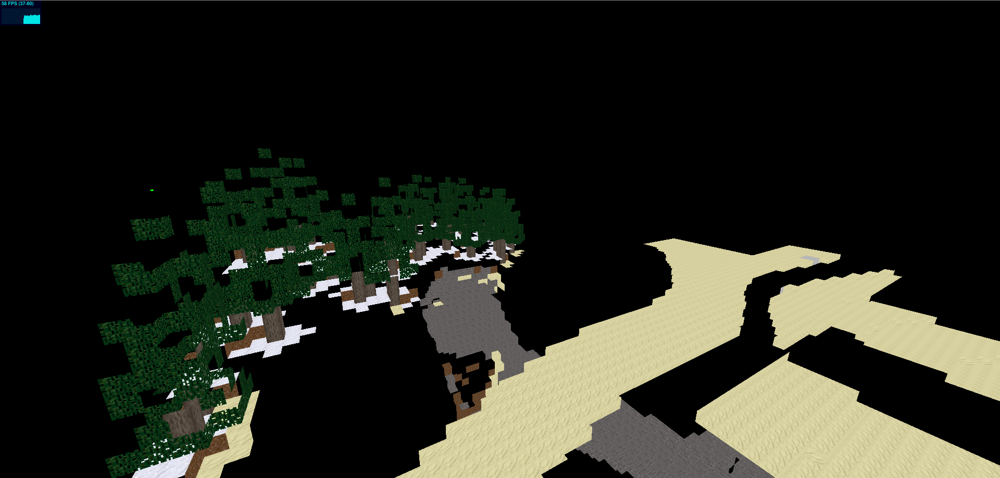

Proof-of-concept minetest client for the browser



## Current state

What works:
* Connecting and authenticating
* Fetching and caching media
* Setting up a (_very_ basic) 3D scene

What doesn't work:
* Player stuff
* everything else :P


## Tools used

* THREEJS
* golang (for the websocket-proxy part)

## Development / Start

Requirements:
* docker-compose
* a proper text-editor

```bash
docker-compose up
```

Visit: http://127.0.0.1:8080

# License

MIT